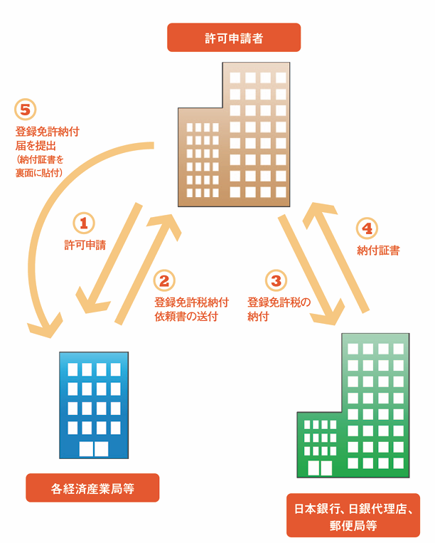

【参考資料】

> https://www.meti.go.jp/policy/alcohol/

## 1-1. アルコールと関係法令

| 名称             | アルコール関係法令 | 所管省庁   |
| ---------------- | ------------------ | ---------- |
| 工業用アルコール | アルコール事業法   | 経済産業省 |
| 酒類             | 酒税法             | 財務省     |
| 医薬品           | 薬事法             | 厚生労働省 |
| アルコール類     | 消防法             | 消防庁     |

- アルコール事業法の対象は、アルコール分（15℃において原容量100分中に含有するエチルアルコールの容量）が90度以上のアルコール。
- 90度未満に希釈した場合はアルコール事業法の適用外となり、そのままでは法令違反になる。
- 1～90度のアルコールを試験研究製造する場合は、『酒税法』が適用される。

## 1-2. 工業用アルコールの分類

- 一般アルコール

  加算額（納税額、アルコール度数によって変動）が含まれていない安価なアルコール。使用にあたっては、事前許可が必要。また、使用等の記帳、使用数量等の定期報告が必要。
- 特定アルコール

  加算額を含むアルコール。使用にあたっての事前許可や記帳などの手続きは必要ない。

## 2-1. アルコール事業法とは

- 目的

  アルコールの特性：種類と物質的に同一。国民生活・産業活動に不可欠。

  流通管理の必要性：酒類の原料への不正な使用の防止。アルコールの安定的かつ円滑な供給
- 概要

**90度以上のエチルアルコール** について厳格な流通管理を実施

1. 許可制
   - 製造業者、輸入業者、販売業者、使用者の許可制
   - 許可事業者は **扱ったアルコールの数量等の帳簿記載、年1回の定期報告**
2. 特定アルコール
   - 流通管理になじまない特別な用途向けに、加算額を含む **特定アルコール（自由流通）の販売制度を措置**（加算額は事業者により国庫納付）。
3. 事後チェック
   - 定期報告による不正利用のチェック
   - **許可事業者等への立入検査によるチェック**

## 2-2. アルコール事業法の許可の対象

- アルコール分90度以上のアルコールについては、 **製造・輸入・販売・使用** においてアルコール事業法による事前の許可を取得する必要がある。
- なお、酒税法の適用を受けているアルコールについては、アルコール事業法の対象外となる。

## 3. 許可を受ける際の手続き

- 許可申請先

  - アルコールの製造・輸入・販売・使用を行おうとする事業者は、事前に **経済産業大臣** の許可が必要。
  - なお、アルコール事業法によって、経済産業大臣の権限は経済産業局長に委任されているため、申請をする際は、それぞれの地域を管轄する各経済産業局（例：関東経済産業局）に対して申請をする。

## 4. 登録免許税について

- **アルコール事業法の許可を取得する際は、登録免許税の納付が必要になる。**
- アルコール事業法の許可に係る登録免許税の額
  |            | 製造   | 輸入   | 販売  | 使用    |
  | ---------- | ------ | ------ | ----- | ------- |
  | 事業の許可 | 15万円 | 15万円 | 9万円 | 1.5万円 |
  | 変更の許可 |        |        |       | 1.5万円 |

## 5. 納付方法

