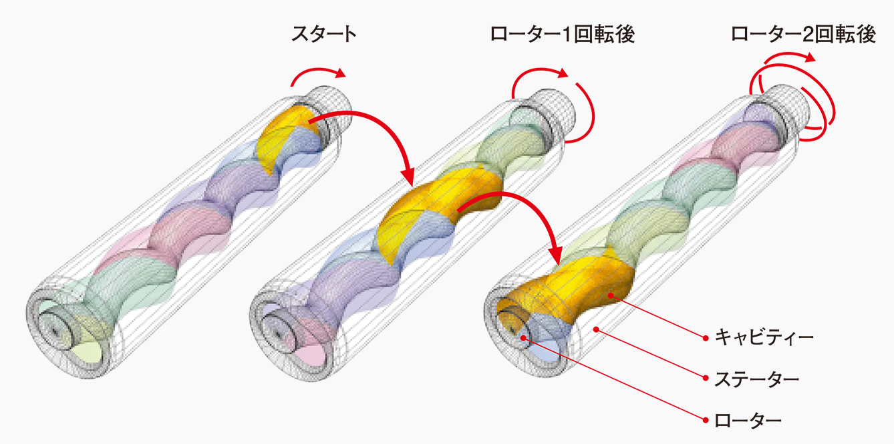
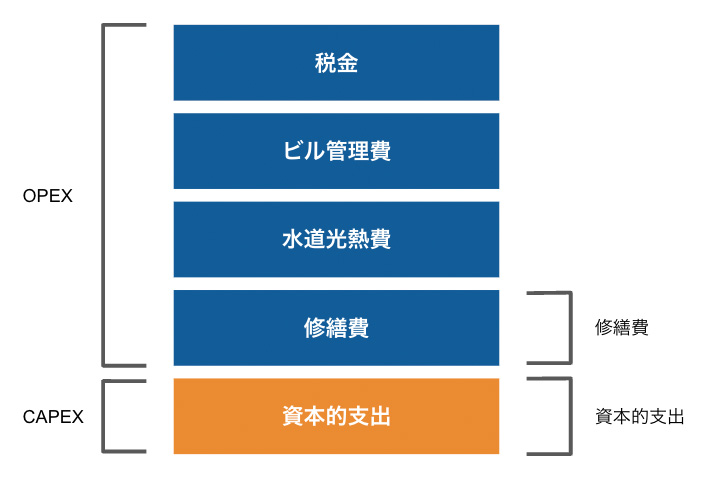
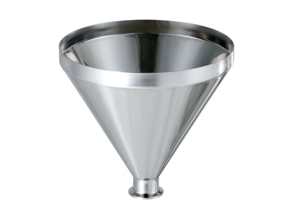
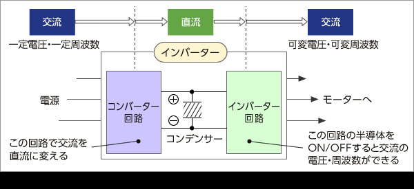
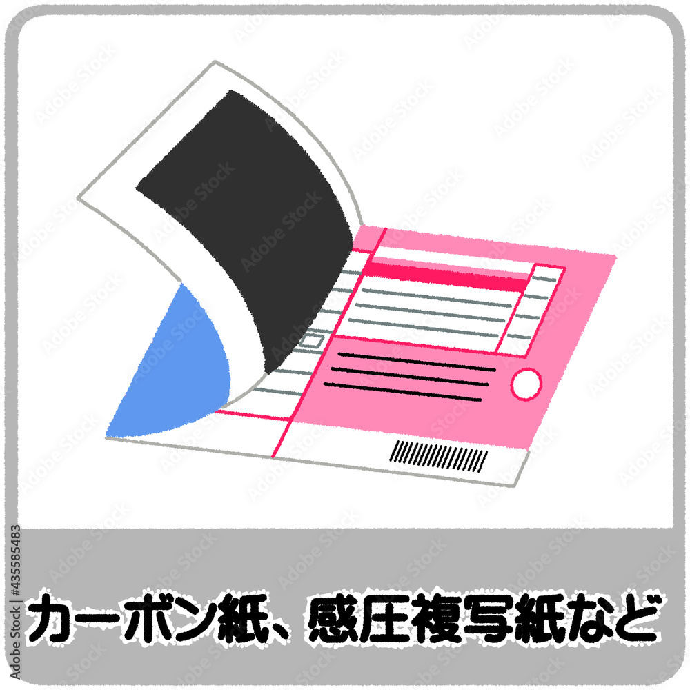
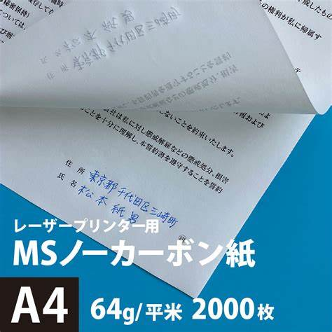

# 用語集

## ・モーノポンプ
  回転容積式一軸偏心ねじポンプに分類されるポンプで、無脈動・定量移送が可能

>https://www.mohno-pump.co.jp/about/construction.html

## ・L&L
    "Lessons Learned" の略で、プロジェクトを通して得られた教訓や知識を指す

## ・OSBL
    ユーティリティ

## ・CAPEX (資本的支出)
    capital expenditure. 設備や不動産といった固定資産の価値を高めるための支出や投資など。
    CAPEXは支出の際に耐用年数に応じた減価償却が必要になる。

## ・OPEX (営業費用)
    operating expense. 製品を生み出す、ビジネスを運営する際にかかる継続的なコスト。
    物件賃貸料や水道光熱費、修繕費のほか、研究開発費や税金など。

## ・エスカレーション費
    投資金額が見積段階から実行段階までに高騰すると予測される費用

## ・ホッパー
    材料の投入・排出に使用される逆円錐状のロート。内容物が底に滞留しにくい形状をしており、多くの場合、排出口（ドレン）部分にバルブを取り付けて流量を調節する。

## ・インバーター
    工場や家庭の電源は一般に交流ですが、その電圧と周波数は一定であり、例えば200V/60Hzや100V/60Hz等のように各国で統一されています。交流の周波数と電圧の大きさを、交流のまま自在に変えることは容易ではありません。そこでインバーター装置を使って、交流を一旦直流に変換（コンバーター回路）した後、再度交流に変換（インバーター回路）することで、周波数と電圧の大きさを自在に変えています。

    学術的には「直流を交流に変換する装置（逆変換器）」だが、電圧や周波数を自由に変更するメカニズムの主役が「インバーター回路」であるため、コンバーター回路・コンデンサー・インバーター回路を合わせた装置そのものが日本ではインバーターと呼ばれている。

    

## ・オフテイカー
    プロジェクトの生産物やサービスを購入し、プロジェクトを成り立たせる役割を担う者

## ・JV (joint venture)
    複数の企業が協力して事業を行う形態のこと。「共同企業体」

## ・逆有償
    業者に委託して産業廃棄物を処理する際、処理業者に支払う金額が、排出者が受けとる金額を上回る取引。
    買ってもらうどころか、あべこべにお金を払わないといけない＝処理費を払うこと

## ・カーボン紙とノーカーボン紙
    カーボン紙は、筆圧によって複写することができる紙で、上に複写元、下に複写先、間にカーボン紙を挟んで書くことで手書き文字が複写できます。
    ノーカーボン紙は、筆圧もしくは打撃によって複数枚に渡り複写を行うことの出来る複写用紙で、カーボンを使用していない。
 

## ・プレジデント
    社長や代表取締役。組織の長。

## ・所掌（しょしょう）
    法令にもとづいて、ある業務を特定の組織が担当すること
    ＊所轄：ある業務を、特定の組織の責任及び権限として管理していること

